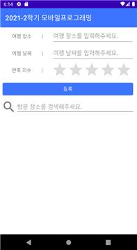
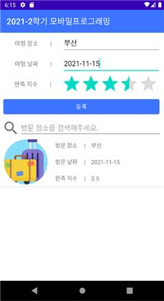
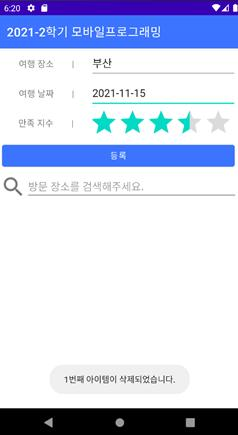
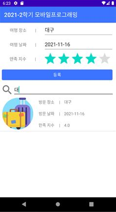

# travel-note-project
👩‍💻 **부경대학교 2021-2학기 모바일프로그래밍 기말 프로젝트**
       
##### ◽ 구현 환경 : Android Studio (API 21: Android 5.0)   
##### ◽ 앱 설명 : 방문 장소, 방문 날짜, 여행에 대한 만족 정도를 저장할 수 있는 간단한 앱   
##### ◽ 구현 기능 : 데이터 추가, 삭제, 조회, 검색   
------------------ 
##### ◽ 앱 실행 화면   

    